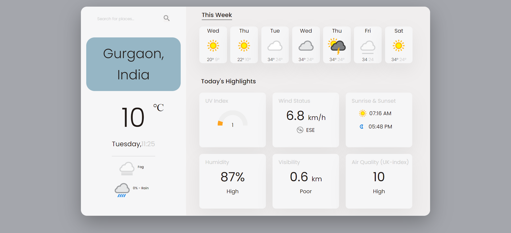

<br/>
<p align="center">
  <a href="https://github.com/rajsinghast03/WeatherApp">
    
  </a>

  <h3 align="center">Weather Site</h3>

  <p align="center">
    A Weather Site that displays real-time weather!
    <br/>
    <br/>
  </p>
</p>


## About The Project



 * Designed and implemented a weather website that provides users with real-time and accurate weather information
 * Integrated third-party API seamlessly to retrieve accurate weather details enhancing the functionality of website
 * Implemented asynchronous functions to efficiently fetch data from the API, ensuring a smooth UX on the website


### Prerequisites


* npm

```sh
npm install npm@latest -g
```

### Installation

1. Get a free API Key at https://www.weatherapi.com/signup.aspx

2. Clone the repo

```sh
git clone https://github.com/rajsinghast03/WeatherApp.git
```

3. Install NPM packages

```sh
npm install
```

4. Create a `config.js` file inside js folder.Enter your API in `config.js`

```JS
const API_KEY = 'ENTER YOUR API';
export API_KEY;
`````


## Contributing

Contributions are what make the open source community such an amazing place to be learn, inspire, and create. Any contributions you make are **greatly appreciated**.
* If you have suggestions for adding or removing projects, feel free to [open an issue](https://github.com/rajsinghast03/moviesHub/issues/new) to discuss it, or directly create a pull request.

### Creating A Pull Request

1. Fork the Project
2. Create your Feature Branch (`git checkout -b feature/AmazingFeature`)
3. Commit your Changes (`git commit -m 'Add some AmazingFeature'`)
4. Push to the Branch (`git push origin feature/AmazingFeature`)
5. Open a Pull Request


